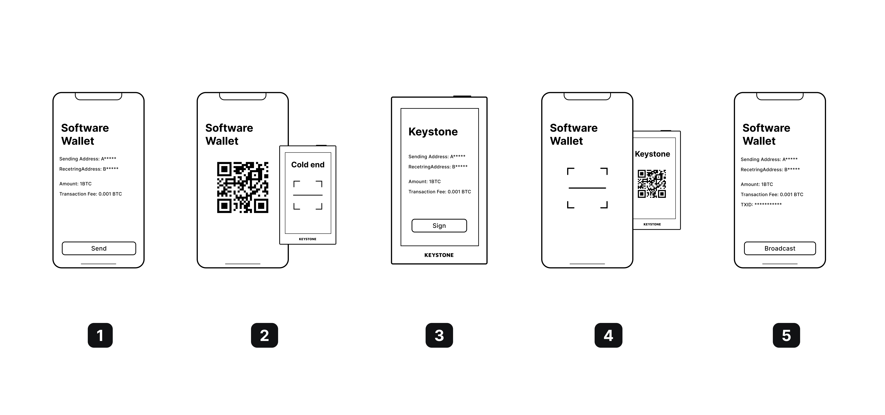

# Sign Transaction & Message

1. The software wallet generates the unsigned transaction or message. For sending the unsigned data to Keystone, the data have to be encoded into the QR code.
2. Use the Keystone hardware wallet to scan the QR Code, Keystone will get the unsigned transaction or message data and display it in a user-friendly way.
3. Sign Transaction on Keystone hardware wallet. After Keystone signs the request, the Keystone device will provide a signature via a QR code.
4. Use the software wallet to extract the signature by scanning the signature showing on the Keystone.
5. The software wallet constructs the signed transaction or message and broadcast it to the blockchain.

> [!Note]
> We build an [Android demo app](https://github.com/KeystoneHQ/keystone-sdk-android-demo/) and [iOS demo app](https://github.com/KeystoneHQ/keystone-sdk-ios-demo/)
> using `KeystoneSDK` to generate sign request QR code and parse signature QR code from Keystone hardware wallet.
